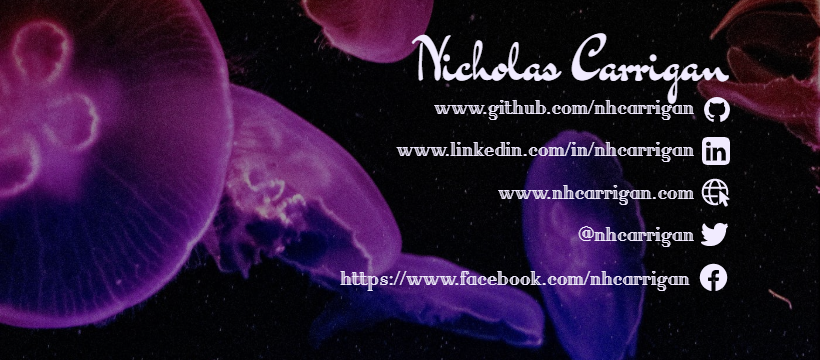

# Nicholas Carrigan

Hello~! Welcome to my GitHub profile! Thank you for coming to visit! 🙃

## About Me

I began my developer journey in April of 2020, starting at the very top of the [freeCodeCamp](https://freecodecamp.org/) curriculum. Through that, I picked up knowledge of HTML, CSS, JavaScript, node.js, React, and D3. Some of those tools stuck, while others did not. After completing the Full Stack web development certification, I started exploring TypeScript and fell in love with it. I used it first for a couple of small projects, then ended up building a Discord bot with it. When freeCodeCamp rolled out the Python curriculum I started exploring Python - but I ended up tabling those studies until later on. I recently picked up Angular and began exploring it, and so far am greatly enjoying what it has to offer!

## Projects

All of my projects are available here on GitHub. You can view my top projects/contributions pinned below this introduction, or you can browse my repositories to see what I have done. Everything I build is open-source, and you are free to fork the repository and play with the code. If you discover a bug or think of a feature to add, feel free to submit issues or pull requests - they are always welcome! Please review our [contributing guidelines](CONTRIBUTING.md) and [Code of Conduct](CODE_OF_CONDUCT.md) first - and see the project's versions for information specific to that project!

## Tech Stack

| Technologies |       |            |         |            |        |         |
| ------------ | ----- | ---------- | ------- | ---------- | ------ | ------- |
| HTML 5       | CSS 3 | JavaScript | node.js | TypeScript | Python | Angular |

## Social Media

## 100 Days of Code

## GitHub Stats

## Coding Stats
